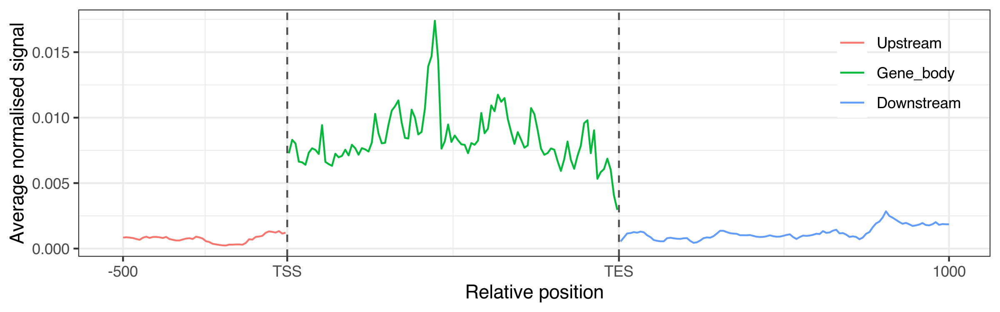

# Mimir package

R package to create metadata profiles for CLIP and other types of NGS data.

### Table of Content

   - [Installation Instructions](#installation-instructions)
      - [Prerequisities](#prerequisities)
      - [Install Repository](#install-repository)
      - [Install Package Release](#install-package-release)
   - [Documentation](#documentation)
      - [Basic Example](#basic-example)
   - [Bugs and Issues](#bugs-and-issues)
   - [License](#license)

## Installation Instructions

### Prerequisities

- [R](https://www.r-project.org/) (>=3.6.0) with a working version of [Bioconductor](https://www.bioconductor.org/).
Although the package has not been tested with previous versions of R, it might still work.

- Required dependencies will be installed via _BiocManager:install()_.

### Install Repository

- Install and load the _devtools_ package:

```
install.packages("devtools")
library(devtools)
```

- Install the [fagostini/Mimir](https://github.com/fagostini/Mimir) package:

```
install_github("fagostini/Mimir", type = "source", repos = BiocManager::repositories(), dependencies = TRUE)
```

### Install Package Release

 - Download the latest source release from [here](https://github.com/fagostini/Mimir/releases) and install it:

```
install.packages(path_to_file, type = "source", repos = BiocManager::repositories(), dependencies = TRUE)
```

## Documentation

- Coming soon...

### Basic Example

This basic example shows how to extract the genomic features (_i.e._, the genes, with their upstream and downstream regions) from a TxDb object

```
# Load the package
library("Mimir")

# Load a pre-compiled TxDb object
library("TxDb.Dmelanogaster.UCSC.dm3.ensGene")

txdb = TxDb.Dmelanogaster.UCSC.dm3.ensGene

# Extract the genomic features
query = extractGenomicFeatures(TxDb = txdb)
```

> Extracted 10562 genes
> 
> Extracted 10559 upstream regions
> 
> Extracted 10562 downstream regions

Now that the regions have been extracted, the signal across these features can be calcualted

```
# Load sample Bam files and packages to read them 
library("GenomicAlignments")
library("pasillaBamSubset")

# Locate and read the alignemnt file
fl1 <- untreated1_chr4()
subject = readGAlignments(fl1)

# Create the profiles across the regions
profile = profileGenomicFeatures(genomicRegions = query, sampleObject = subject, TxDb = txdb)
```

> Upstream regions on + strand: 5261
>
> Upstream regions on - strand: 5298
> 
> Gene_body regions on + strand: 5264
> 
> Gene_body regions on - strand: 5298
> 
> Downstream regions on + strand: 5264
> 
> Downstream regions on - strand: 5298

Finally, the profile obtained can be visualised

```
# Load the plotting package
library("ggplot2")

# Plot the profiles
ggplot(profile, aes(x=bin, y=Mean, colour=region_id)) + 
   geom_line() +
   geom_vline(xintercept=c(50.5, 150.5), linetype="dashed", colour="grey30") +
   scale_x_continuous("Relative position",
        breaks=c(1, 50.5, 150.5, 250), label=c("-500", "TSS", "TES", "1000")) +
   scale_y_continuous("Average normalised signal") +
   coord_cartesian(xlim=c(0, 250)) +
   theme_bw() +
   theme(legend.position=c(0.9, 0.8), legend.background=element_blank()) +
   guides(colour=guide_legend(title=""))
```



## Bugs and Issues

Report bugs as issues on the [GitHub repository](https://github.com/fagostini/Mimir/issues)

<!-- ## Author

* [Federico Agostini](https://github.com/fagostini) -->

## License

This project is licensed under the MIT License - see the [LICENSE](LICENSE) file for details
